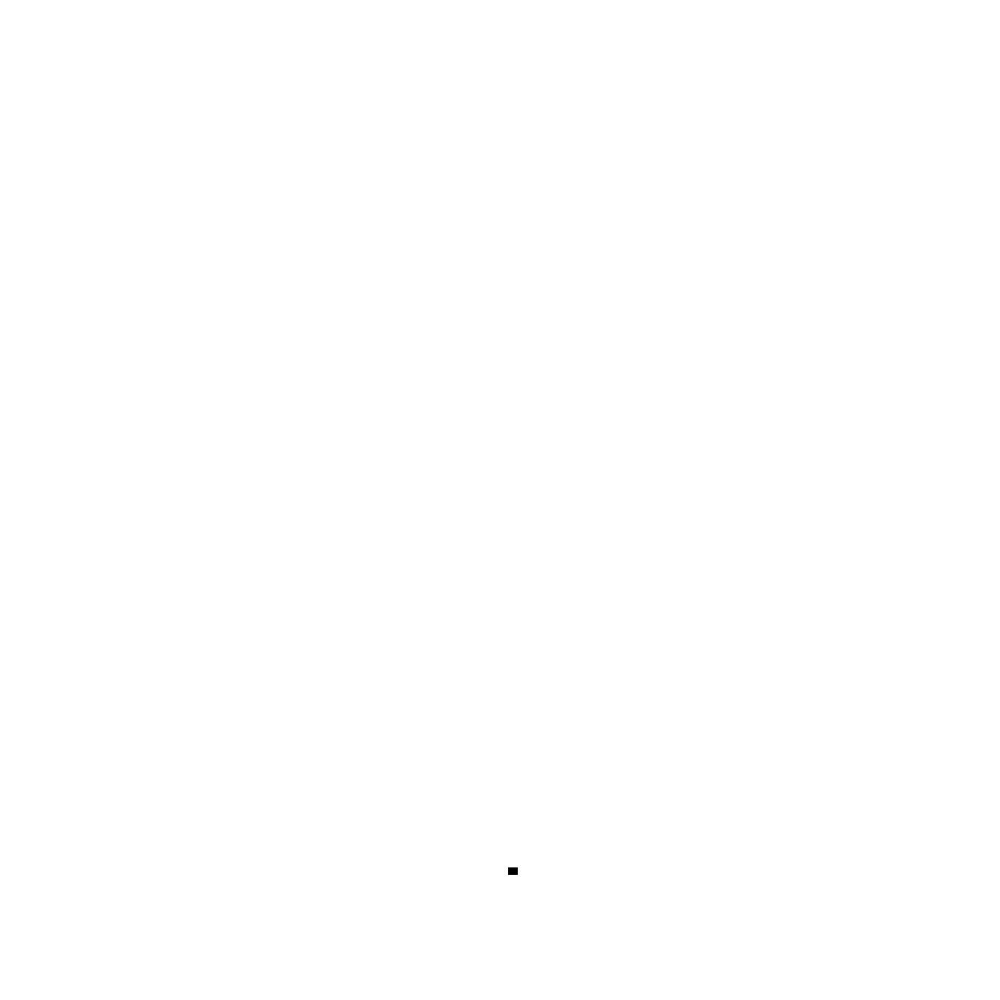

# Wolfram's Cellular Automaton

This repository illustrates the concept of Wolfram's [cellular automaton](https://en.wikipedia.org/wiki/Cellular_automaton), a simple yet powerful model for simulating complex systems. The cellular automaton is a grid of cells, where each cell can be in one of two states, either $0$ or $1$. The grid evolves over discrete time steps according to a set of rules based on the states of neighboring cells. The rules can produce a wide range of interesting patterns and behaviors, some of which resemble natural phenomena.

To run the notebooks, simply execute the provided code cells. The notebook generates an animation of the cellular automaton's evolution for a given rule number and initial state. You can modify the rule number and initial state to explore different patterns and behaviors.

## Formal Definitions

A cellular automaton is a discrete dynamical system that consists of a regular grid of cells, each having a finite set of states. The grid can be of any finite dimension (e.g., 1D, 2D, 3D). The cells evolve in discrete time steps according to a local, deterministic rule that depends on the states of the cell and its neighbors.

A **cellular automaton** is a tuple $(L, S, N, f)$, where:

- **Lattice** ($L$): The lattice is the set of all cell positions in the grid. It can be finite or infinite. The dimensionality of the lattice determines the type of grid (e.g., 1D line, 2D plane, 3D volume). In our case, we're working with a one-dimensional lattice.

- **States** ($S$): Each cell can have one of a finite set of states. In our case, the state set $S = \{0, 1\}$, where 0 represents an "off" or "empty" cell and 1 represents an "on" or "filled" cell.

- **Neighborhood** ($N$): The neighborhood of a cell is a set of nearby cells, including the cell itself, whose states can influence the next state of the cell. The neighborhood function $N$ assigns a set of neighboring cells to each cell in the lattice $L$. Common neighborhood types in 2D cellular automata include von Neumann and Moore neighborhoods.

- **Transition function** ($f$): The transition function is a deterministic rule that maps the current states of a cell and its neighbors to a new state for the cell. The transition function is applied to all cells in the lattice simultaneously at each time step.

The global configuration of the cellular automaton at time step $t$ is a function $C: L \rightarrow S$ that assigns a state to each cell in the lattice. The evolution of the cellular automaton can be described by a sequence of global configurations $C(t)$ for $t = 0, 1, 2, ...,$ where:

$$\begin{equation*}
C_i(t + 1) = f(C_{i - r}(t), C_{i - r + 1}(t), ..., C_{i + r}(t))
\end{equation*}$$

Here, $C_i(t)$ is the state of the $i$-th cell at time step $t$, $r$ is the radius of the neighborhood, and the transition function $f$ maps the states of the cell and its neighbors within the neighborhood to a new state for the cell.

Cellular automata have been used to model a wide range of phenomena in various fields, such as physics, biology, chemistry, computer science, and social science. The simplicity and flexibility of cellular automata make them a powerful tool for studying complex systems and emergent behavior.

## Wolfram's Rule

Wolfram's rule is a specific transition function $f$, determined by a rule number, which is an integer between 0 and 255. The rule number is represented as an 8-bit binary number, with each bit corresponding to a unique 3-cell neighborhood configuration.

For example, Rule 90 is represented as the binary number 01011010, which corresponds to the following update rules:

$$
\begin{aligned}
    111 &\rightarrow 0, \\
    110 &\rightarrow 1, \\
    101 &\rightarrow 0, \\
    100 &\rightarrow 1, \\
    011 &\rightarrow 1, \\
    010 &\rightarrow 0, \\
    001 &\rightarrow 1, \\
    000 &\rightarrow 0. \\
\end{aligned}
$$

## Applications

Cellular automata have been used in various fields to model and simulate complex systems and phenomena. Some real-world applications of cellular automata include:

- **Fluid dynamics**: Cellular automata can be used to simulate fluid flow and model the behavior of gases and liquids. The Lattice Boltzmann method, based on cellular automata, is a popular approach for simulating fluid dynamics.

- **Traffic flow**: Cellular automata models have been used to simulate traffic flow on highways and urban road networks. These models can help researchers understand traffic congestion and optimize traffic light timings and road layouts.

- **Urban planning and growth**: Cellular automata can model land use changes and urban growth patterns. Planners can use these models to predict the impact of development policies and infrastructure projects on urban sprawl and land use.

- **Ecology and population dynamics**: Cellular automata can be used to model the spread of diseases, the growth and movement of animal populations, and the dynamics of ecosystems. These models can help researchers understand the factors that affect population sizes and the spread of diseases.

- **Epidemiology**: Cellular automata can model the spread of infectious diseases through populations, taking into account factors such as population density, mobility, and social interactions. These models can help public health officials predict the course of an epidemic and evaluate the effectiveness of control measures.

- **Pattern formation and crystal growth**: Cellular automata can model the process of pattern formation in nature, such as the growth of crystals, snowflakes, and biological structures. Researchers can use these models to study the underlying mechanisms of pattern formation and self-organization.

- **Forest fire propagation**: Cellular automata can be used to model the spread of forest fires, taking into account factors such as wind direction, terrain, and vegetation type. These models can help researchers predict the behavior of wildfires and develop strategies for fire management and prevention.

- **Image processing and pattern recognition**: Cellular automata can be used for image processing tasks, such as noise reduction, edge detection, and pattern recognition. Their parallel and local nature makes them well-suited for these tasks.

- **Cryptography and secure communication**: Cellular automata can be used to generate pseudo-random number sequences and create encryption algorithms for secure communication.

These are just a few examples of the many possible applications of cellular automata. Their simplicity, flexibility, and ability to model complex systems make them a powerful tool for studying and simulating a wide range of phenomena in various fields.

## References

1. Wolfram, S. (1983). [Statistical mechanics of cellular automata](https://journals.aps.org/rmp/abstract/10.1103/RevModPhys.55.601). *Reviews of Modern Physics*, 55(3), 601.
2. Wolfram, S. (1984). [Universality and complexity in cellular automata](https://doi.org/10.1016/0167-2789(84)90245-8). *Physica D: Nonlinear Phenomena*, 10(1-2), 1-35.
3. Wolfram, S. (2002). [*A new kind of science*](https://www.wolframscience.com/nks/). Wolfram Media, Inc.
4. von Neumann, J., & Burks, A. W. (1966). [Theory of Self-reproducing Automata](https://archive.org/details/theoryofselfrepr00vonn). University of Illinois Press.
5. Gardner, M. (1970). [The fantastic combinations of John Conway's new solitaire game "life"](https://doi.org/10.1038/scientificamerican1070-120). Scientific American, 223(4), 120-123
6. Weisstein, E. W. (2002). [Cellular Automaton](https://mathworld.wolfram.com/CellularAutomaton.html). MathWorld--A Wolfram Web Resource

## License

This project is licensed under the GNU General Public License v3.0 (GPL-3.0). For more information, please see the [LICENSE](LICENSE) file or visit [https://www.gnu.org/licenses/gpl-3.0.en.html](https://www.gnu.org/licenses/gpl-3.0.en.html).

